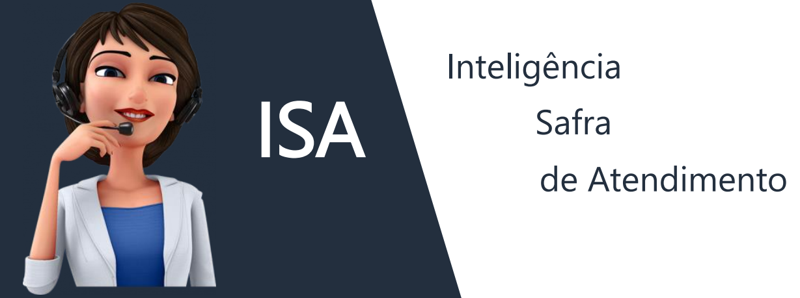

<h1 align="center">
  ISA - INTELIGÊNCIA SAFRA DE ATENDIMENTO - FINHACK
</h1>

  <a href="#memo-sobre">Sobre</a>&nbsp;&nbsp;&nbsp;|&nbsp;&nbsp;&nbsp;
  <a href="#-tecnologias">Tecnologias</a>&nbsp;&nbsp;&nbsp;|&nbsp;&nbsp;&nbsp;
  <a href="#-projeto">Projeto</a>&nbsp;&nbsp;&nbsp;|&nbsp;&nbsp;&nbsp;
  

 

  

## :memo: Sobre

Completa, acessível e de fácil utilização, a assistente virtual ISA, estará 24 horas por dia, 07 dias na semana, disponível para te auxiliar no que for preciso.
Chega de fila para ser atendido, daquelas ligações cheia de opções confusas. Mais que uma simples assistente virtual, a ISA te dá dicas de investimento, responde aquelas dúvidas, facilita suas transações, te aproxima do banco de uma maneira simples e descomplicada.
Queremos mais que somente te atender, queremos te OUVIR.

## 🚀 Tecnologias

Esse projeto foi desenvolvido com as seguintes tecnologias:

- [Amazon Alexa](https://developer.amazon.com/)
- [AWS Amazon](https://aws.amazon.com/)
- [Watson Machine Learning](https://www.ibm.com/br-pt/analytics/machine-learning)
- [Watson Discovery](https://cloud.ibm.com/docs/discovery?topic=discovery-about)
- [Watson Natural Language Understanding](https://natural-language-understanding-demo.ng.bluemix.net/?_ga=2.1261681.1545693594.1606099804-1855578334.1603764723&_gac=1.90509672.1603764723.Cj0KCQjw59n8BRD2ARIsAAmgPmKEiNjDHF5ScZGNl_Nk_mJhpPEyJTJtmdv9fphJrxZG-QKQ6j0mLGsaAmPFEALw_wcB&cm_mc_uid=32912961292916037647226&cm_mc_sid_50200000=10686531606181016972)
- [Node.js](https://nodejs.org/en/)
- [Google Apis](https://developers.google.com/)
- [SendGrid Api](https://sendgrid.com/)

## 💻 Projeto

O projeto foi desenvolvido no HACKATHON FINHACK, com o objetivo de criar uma assistente virtual, chamada ISA, para auxiliar os clientes do Banco Safra a contratar produtos e demandar serviços utilizando a plataforma Alexa. 

## 👔 Colaboradores

Desenvolvido pelos profissionais:

- [Rafael Magalhães](https://www.linkedin.com/in/rlmagalhaes/)
- [Caio Robaldo](https://github.com/WolfMagal/isa-alexa-safra)
- [Diogo Banzer](https://www.linkedin.com/in/diogobanzer/)
- [Fábio Augusto](https://www.linkedin.com/in/fabaugsilv/)
